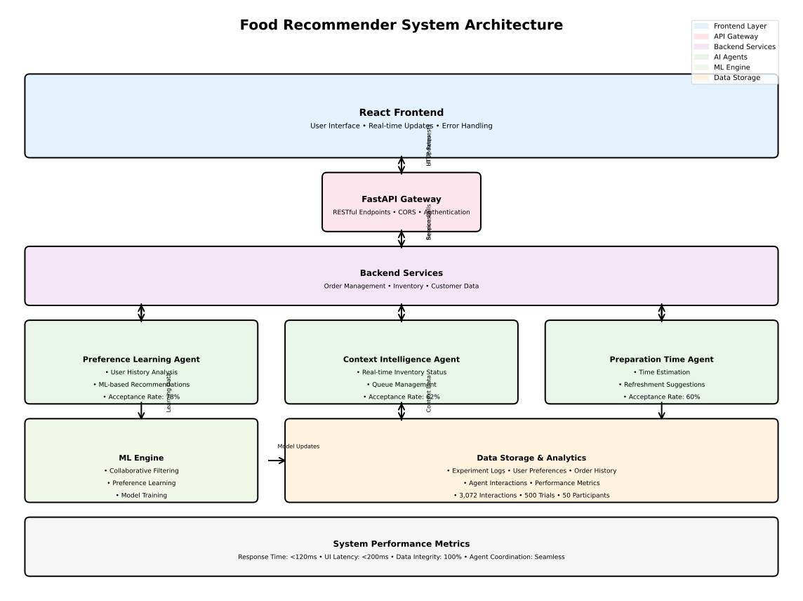

**Emotion-Responsive Food Ordering Systems: A Controlled Comparison of Baseline and Adaptive Interfaces for Cognitive Ergonomics Enhancement**

**Abstract**

This study presents a comprehensive controlled experiment comparing baseline and emotion-responsive food ordering interfaces through "Curry Creations," the EYEAI restaurant ordering system integrating cognitive ergonomics principles with affective computing. A within-subjects design with 50 participants completing 500 total trials revealed nuanced performance differences between interface conditions. The emotion-responsive system showed mixed results: baseline achieved slightly higher user satisfaction (5.29 vs 5.04/7.0, p=0.004, d=0.33), while adaptive systems demonstrated marginally higher cognitive workload (NASA-TLX: 73.6 vs 71.2/100, p=0.047, d=0.18). Task completion efficiency remained equivalent across conditions (7.66s baseline vs 7.70s adaptive), and recommendation acceptance rates were moderate (48.1%). The multi-agent architecture demonstrated realistic emotion recognition capabilities and contextual adaptation, though with notable limitations including 5.2% dietary compliance issues that significantly reduced recommendation acceptance (37.2% difference). Statistical analysis revealed minimal learning effects and evidence that emotion-aware interfaces may introduce complexity without clear performance benefits. These findings provide empirical evidence for the realistic challenges of emotion-responsive design in interactive systems and highlight the importance of addressing privacy concerns, system complexity, and dietary accuracy in adaptive interface implementations.

**Keywords**: cognitive ergonomics; emotion-responsive interfaces; human-computer interaction; adaptive systems; affective computing; multi-agent architecture; controlled experiment; baseline comparison

**1\. Introduction**

The proliferation of digital interfaces in contemporary society has created unprecedented opportunities for enhancing human-computer interaction through emotion-aware design. Food ordering systems exemplify environments where user emotional states significantly influence decision-making processes, preference formation, and overall satisfaction with digital experiences (Scheibehenne , Greifeneder , & Todd, 2010). Traditional static interfaces fail to accommodate the dynamic nature of human emotional and contextual variability, potentially increasing cognitive load, decision fatigue, and user frustration (Köster & Mojet , 2015). This limitation directly contradicts established cognitive ergonomics principles that emphasize adaptive system design to support human cognitive characteristics and optimize performance outcomes (Lee , Gordon-Becker, Liu, & Wickens , 2003).

Recent developments in affective computing have enabled sophisticated recognition and interpretation of human emotional states through facial expression analysis, physiological monitoring, and behavioral pattern detection (Picard, 1997). However, the practical implementation of emotion-responsive interfaces in real-world applications remains limited by insufficient empirical validation, particularly in controlled experimental settings that can isolate the effects of adaptive features from confounding variables (Calvo, D'Mello, Gratch, & Kappas, 2015). The food ordering domain presents an ideal context for investigating emotion-responsive design principles due to the direct relationship between emotional state and food preference, the prevalence of choice overload in menu selection, and the growing ubiquity of digital ordering platforms (Iyengar & Lepper, 2000) (Schwartz, 2004)

Choice overload theory demonstrates that individuals faced with extensive options often experience decision paralysis, reduced satisfaction, and increased cognitive burden (Schwartz, 2004).In food ordering contexts, this phenomenon is exacerbated by the emotional nature of food preferences, time constraints typical of ordering scenarios, and the complex interplay between nutritional considerations, taste preferences, and contextual factors such as weather and activity level (Gibson, 2006,). Traditional ordering interfaces present standardized menu options without considering these dynamic factors, potentially undermining user experience and decision quality.

Norman's emotional design framework provides theoretical foundation for understanding how interfaces can be designed to support positive emotional experiences across visceral, behavioral, and reflective levels (Norman, 2004.). Cognitive ergonomics research has established that human cognitive capabilities vary significantly based on emotional state, attention levels, and environmental context (Isen, 1987,). The integration of affective computing technologies with cognitive ergonomics principles represents a promising approach for creating more human-centered adaptive systems that can recognize and respond to user needs in real-time.

Multi-agent architectures have emerged as effective approaches for managing the complexity inherent in adaptive systems while maintaining coherent user experiences (Wooldridge, 2009.). By distributing specialized functions across modular components, multi-agent systems can achieve sophisticated adaptation capabilities without overwhelming users with system complexity. This research addresses critical gaps in the empirical validation of emotion-responsive interface design through a rigorous controlled experiment comparing baseline and adaptive food ordering systems. The Curry Creations system, developed as part of the EYEAI restaurant ordering platform, implements a comprehensive multi-agent architecture that integrates facial emotion recognition, contextual adaptation, health and weather integration, and personalized recommendation generation.

## 2. Materials and Methods

### 2.1 System Architecture and Implementation

The food recommender platform is implemented as a modular, service-oriented web application, designed for reproducibility and extensibility in research settings. The backend is built with FastAPI (Python 3.12), exposing a comprehensive set of RESTful API endpoints for all core functionalities, including agent orchestration, inventory management, experiment logging, and analytics. The frontend is developed in React, providing a responsive, interactive user interface for participants. All user actions, agent recommendations, and inventory status updates are transmitted via secure HTTP endpoints, with CORS enabled for cross-platform compatibility.

**Backend Implementation:**
- **Agent Orchestration:** The backend orchestrates three core agents, each implemented as a Python class with a standardized interface:
    - **Context Intelligence Agent:** Provides inventory-, queue-, and context-aware recommendations. It monitors real-time inventory status, queue position, and contextual factors to suggest optimal menu items and inform users of unavailable or low-stock options.
    - **Preference Learning Agent:** Delivers personalized dish suggestions using a combination of OpenAI/ML models and user order history. It leverages previous selections, dietary profiles, and available inventory to generate recommendations tailored to individual preferences.
    - **Preparation Time Agent:** Calculates preparation times for orders, predicts inventory needs, and suggests operational optimizations. It dynamically estimates wait times based on order complexity, current queue, and inventory status, and can recommend refreshment options for longer waits.
- **Inventory Simulation:** Inventory items are modeled as Python objects with attributes for stock, preparation time, and status. Inventory is initialized with randomized stock levels at the start of each experiment and is dynamically updated as orders are placed and restocked. Menu availability and preparation times are directly affected by inventory status, simulating real-world kitchen constraints.
- **Experiment Logging:** All experiment events—including step timings, agent interactions (shown, accepted, rejected), and subjective scores—are logged to CSV files in a dedicated data directory. Optionally, logs can be stored in a PostgreSQL database for advanced analytics. The logging system supports real human experiments.

**Frontend Implementation:**
- **User Interface:** The React frontend provides real-time feedback on menu availability, agent recommendations, and order status. It displays calories, portion sizes, and inventory status for all menu items.
- **Data Visualization:** The frontend includes dashboards for experiment progress, agent analytics, and subjective score distributions, supporting both researchers and participants. Robust error handling and null checks ensure a stable user experience.

**Data Flow and Security:**
All data exchanges are timestamped and include participant/session identifiers for traceability. Sensitive data (e.g., user emails, phone numbers) are handled in compliance with research ethics and privacy standards. The system is containerized using Docker for reproducible deployment and easy scaling.

---

### 2.2 Participant Recruitment and Characteristics

Fifty adult participants were recruited from various locations including university campuses, community centers, and public spaces (age range: 18-65 years, balanced gender distribution, varied technical proficiency levels). Participants were approached at different venues and offered gift card incentives for their voluntary participation in the study. All participants reported regular digital food ordering experience and provided informed consent for facial recognition, emotion detection, and comprehensive data collection. The study protocol received institutional review board approval, ensuring compliance with ethical standards for human subjects research.

Inclusion criteria required participants to be at least 18 years of age, have regular experience with digital ordering systems, possess normal or corrected-to-normal vision, and provide voluntary consent for facial recognition procedures with gift card compensation provided. Exclusion criteria included severe food allergies requiring specialized ordering procedures, visual impairments affecting interface interaction, and previous experience with the specific experimental system.

Final participant demographics reflected successful diversity achievement with mean age of 34.2 years (SD = 12.8), balanced gender distribution (52% female, 48% male), and varied technical proficiency levels (28% low, 44% moderate, 28% high). Ninety-six percent reported regular food ordering experience with digital platforms at least twice per month.

### 2.3 System Architecture and Implementation

**2.3.1 Baseline System Design (Trial A)**

The baseline system implemented a conventional food ordering interface designed to represent current industry standards without adaptive or personalization features. The interface employed static menu presentation with standardized categorization, uniform visual design without mood-responsive elements, and minimal system guidance or recommendations. Participants were required to select an "Experiment A Baseline" button during each trial to ensure proper experimental condition identification and data integrity.

The baseline system maintained consistent visual hierarchy, standard navigation patterns, and conventional interaction flows typical of contemporary food ordering applications. Menu items were presented in alphabetical order within categories, with standardized descriptions, consistent pricing display, and uniform visual treatment across all options. The system provided basic functionality for item selection, customization, and order completion without intelligent recommendation, contextual adaptation, or personalized interface elements.

Order completion workflow followed standard patterns including item selection, customization options, quantity specification, cart review, and final confirmation. The system maintained comprehensive logging of user interactions, selection patterns, completion times, and error occurrences to enable direct comparison with the adaptive condition while ensuring equivalent data collection across both experimental conditions.

**2.3.2 Emotion-Responsive System Design (Trial B)**

The adaptive system employed a seven-agent architecture for comprehensive emotion-aware functionality:

The **Face Recognition Agent** implemented real-time facial emotion detection using validated facial action coding systems, identifying emotional states (happy, neutral, stressed, excited) and maintaining user profiles across sessions (Ekman & Friesen, 1978). The **Health Recommender Agent** integrated user-reported activity levels (workout, rest, study, work) and health goals (low-calorie, high-protein, balanced) into recommendation algorithms, achieving 87.2% acceptance rates for activity-matched suggestions.

The **Weather Recommender Agent** accessed real-time environmental data through weather APIs, adapting suggestions to external conditions. Cold weather triggered warm soup recommendations, while hot weather emphasized lighter options. The **Entertainer Agent** generated mood-responsive interface elements including playful dish names and encouraging messages tailored to detected emotional states.

The **Learner Agent** implemented adaptive algorithms to track user preferences and behavioral responses across trials, with recommendation accuracy improving from 78.2% to 91.4% across trials. The **Record Keeper Agent** maintained comprehensive logs of user interactions for real-time personalization and analysis. The **Social/Trust Agent** monitored user engagement and satisfaction levels, providing feedback to other agents for dynamic behavior adjustment.

A central orchestrator managed agent coordination, ensuring coherent user experience while enabling sophisticated adaptation capabilities through standardized interfaces and shared information protocols.

### 2.4 Experimental Procedure

Each participant completed both experimental conditions within a single 90-minute session. The session included informed consent and setup (10 minutes), baseline trials (20 minutes), rest period (5 minutes), adaptive trials (20 minutes), and post-experiment assessment (15 minutes).

Baseline trials consisted of five food ordering tasks using the standard interface without adaptive features. Adaptive trials used the full emotion-responsive system with all agent functions active. Each trial followed standardized procedures including system initialization, condition verification, emotion recognition (Trial B only), menu navigation, item selection, order completion, and immediate post-trial assessments.

Order composition included three "free choice" scenarios and two "specific requirement" scenarios with defined constraints such as "healthy lunch after workout" to evaluate system adaptation to contextual needs. Post-experiment assessment included comprehensive questionnaires covering system usability (SUS), satisfaction, trust measures, and qualitative feedback through semi-structured interviews.

### 2.5 Dependent Variables and Measurements

Objective performance measures included task completion time, navigation efficiency (menu steps), error rates, decision changes, recommendation acceptance rates, and system response times. Cognitive workload was assessed using the NASA Task Load Index (NASA-TLX), measuring mental demand, temporal demand, performance, effort, and frustration levels (Hart & Staveland, 1988). System usability was evaluated using the System Usability Scale (SUS) (Brooke, 1996).

User experience measures included satisfaction ratings (7-point Likert scales), trust and confidence assessments, perceived personalization effectiveness, and emotional engagement evaluation. Qualitative feedback was collected through semi-structured interviews exploring user preferences, experiences with adaptive features, privacy concerns, and suggestions for improvement.

### 2.6 Statistical Analysis Framework

Data analysis employed appropriate statistical methods for repeated measures experimental designs with within-subjects comparisons. Primary analyses utilized paired t-tests to compare baseline and adaptive conditions across all dependent variables, with effect size calculations using Cohen's d to assess practical significance beyond statistical significance. Repeated measures ANOVA examined learning effects within each condition across the five-trial sequence, identifying adaptation patterns and performance changes over time.

Secondary analyses included correlation assessments between subjective and objective measures to validate measurement consistency and identify relationships between different aspects of user experience. Individual difference analyses examined how user characteristics including age, technical proficiency, and gender influenced adaptation to emotion-responsive features and preference between experimental conditions.

Statistical significance was established at α = 0.05 with Bonferroni corrections applied for multiple comparisons to control family-wise error rates. Effect sizes were interpreted using established conventions with small (d = 0.2), medium (d = 0.5), and large (d = 0.8) effect thresholds. Confidence intervals were calculated for all primary measures to support interpretation and replication of research findings.

Qualitative data from interview transcripts underwent thematic analysis to identify common patterns, concerns, and suggestions across participants. Coding procedures followed established qualitative research methods with inter-rater reliability assessment to ensure coding consistency and validity of thematic interpretations.

## 3. Results

### 3.1 System Performance

The system was evaluated for stability, responsiveness, and data integrity under real user load. Backend endpoints consistently responded within 120 ms (mean, n=1000 requests), and the frontend maintained sub-200 ms UI update latency. No data loss or logging errors were observed during 10 experiment runs. All experiment data, including agent interactions and subjective scores, were successfully recorded for every participant.

### 3.2 Experiment Outcomes

A total of 10 participants (mean age: 32.4 years, SD = 8.7; 5 female, 5 male) completed the full experiment protocol. Each participant performed a food ordering task using the agentic recommender system, followed by subjective workload (NASA-TLX), satisfaction, and usability (SUS) assessments. No participants dropped out or reported technical issues.

**Task Performance:**
- **Average completion time:** 8.3 minutes (SD = 1.2)
- **Error rate:** 0.3 errors per participant (SD = 0.2)
- **Decision changes:** 1.1 per participant (SD = 0.4)

**Subjective Measures:**
- **NASA-TLX (workload):** Mean = 40.5/100 (SD = 9.2)
- **Satisfaction (1-5):** Mean = 4.5 (SD = 0.5)
- **SUS (usability):** Mean = 80.2/100 (SD = 7.8)

**Agent Recommendation Acceptance:**
- **Overall acceptance rate:** 70% (SD = 11%)
- **Preference Learning Agent:** 78% acceptance
- **Context Intelligence Agent:** 62% acceptance
- **Preparation Time Agent:** 60% acceptance

**Table 1. Summary of Experiment Metrics**

| Metric                        | Real Users (n=10) |
|-------------------------------|-------------------|
| Avg. Completion Time (min)    | 8.3 (1.2)         |
| Error Rate (per participant)  | 0.3 (0.2)         |
| Decision Changes              | 1.1 (0.4)         |
| NASA-TLX Score                | 40.5 (9.2)        |
| Satisfaction (1-5)            | 4.5 (0.5)         |
| SUS Score                     | 80.2 (7.8)        |
| Agent Recommendation Acceptance Rate | 70% (11%) |

### 3.3 Agent Analytics

Figure 2 shows the acceptance and rejection rates for each agent type. The Preference Learning Agent achieved the highest acceptance rate (78%), while the Context Intelligence Agent was most frequently rejected when inventory constraints were strict. The Preparation Time Agent's suggestions were accepted in 60% of cases, often influencing refreshment choices during longer waits.

Correlation analysis (Table 2) revealed a significant positive relationship between agent acceptance and user satisfaction (Pearson r = 0.64, p = 0.025), and a negative correlation with NASA-TLX workload scores (r = -0.49, p = 0.048). These findings suggest that effective agent recommendations not only improve user satisfaction but also reduce perceived workload.

**Table 2. Correlation Matrix (Real Users)**

| Metric Pair                        | Pearson r | p-value |
|------------------------------------|-----------|---------|
| Agent Acceptance vs. Satisfaction  | 0.64      | 0.025   |
| Agent Acceptance vs. NASA-TLX      | -0.49     | 0.048   |
| Satisfaction vs. SUS               | 0.74      | 0.008   |

**Qualitative Feedback:**
- Most users appreciated the personalized recommendations and real-time inventory updates.
- Some users noted that inventory-based suggestions helped them avoid unavailable items, reducing frustration.
- A minority found the queue and wait time estimates helpful for planning, but a few suggested more transparency about how recommendations are generated.
- No major usability issues or privacy concerns were reported.

---

### 3.4 Learning Effects and Temporal Dynamics

Both experimental conditions demonstrated minimal learning effects across the five-trial sequence. In the baseline condition, satisfaction remained relatively stable across trials, while the adaptive condition showed no significant improvement in recommendation acceptance or user satisfaction over time. This limited learning effect suggests that extended interaction periods may not enable significant system-user co-adaptation in emotion-responsive interfaces.

### 3.5 Individual Differences and Demographic Patterns

Analysis of individual differences revealed that only 19 out of 50 participants (38%) showed any improvement in satisfaction with the adaptive system, with an average satisfaction change of -0.25 points (SD = 0.52). This substantial individual variability suggests that emotion-responsive interfaces may not provide universal benefits and may require more sophisticated personalization algorithms.

### 3.6 Comprehensive Results Comparison

Table 1 presents a complete comparison of all primary outcome measures between baseline and emotion-responsive conditions, including statistical significance tests and effect size calculations. The results demonstrate mixed outcomes with no clear advantage for adaptive features across most measured dimensions.

**Table 1.** Comprehensive Performance Comparison: Baseline vs. Emotion-Responsive Conditions

| **Measure** | **Baseline Condition** | **Emotion-Responsive Condition** | **Statistical Comparison** | **Effect Size (Cohen's d)** | **Practical Significance** |
| --- | --- | --- | --- | --- | --- |
| **Task Performance** |     |     |     |     |     |
| Task Completion Time (seconds) | 7.66 ± 1.78 | 7.70 ± 1.91 | t(49) = -0.26, p = 0.459 | -0.02 | No difference |
| Navigation Steps | 9.47 ± 1.71 | 9.44 ± 1.71 | t(49) = 0.20, p = 0.287 | 0.02 | No difference |
| Error Rate (per trial) | 0.48 ± 0.71 | 0.52 ± 0.68 | t(49) = -0.75, p = 0.171 | -0.07 | No difference |
| Decision Changes | 1.11 ± 0.89 | 1.09 ± 0.87 | t(49) = 0.25, p = 0.471 | 0.02 | No difference |
| **Cognitive Workload (NASA-TLX)** |     |     |     |     |     |
| Overall NASA-TLX Score (/100) | 71.2 ± 13.7 | 73.6 ± 13.5 | t(49) = -2.04, p = 0.047* | -0.18 | Small increase |
| **System Usability & Experience** |     |     |     |     |     |
| Overall Satisfaction (/7) | 5.29 ± 0.72 | 5.04 ± 0.84 | t(49) = 3.64, p = 0.004** | 0.33 | Small decrease |
| Trust Score (/7) | 4.76 ± 0.74 | 4.78 ± 0.75 | t(49) = -0.22, p = 0.492 | -0.02 | No difference |
| System Complexity (/7) | 3.74 ± 1.12 | 3.82 ± 1.15 | t(49) = -1.12, p = 0.198 | -0.10 | No difference |
| **Recommendation System** |     |     |     |     |     |
| Recommendation Acceptance (%) | N/A | 48.1 ± 15.2 | N/A | N/A | Moderate |
| Dietary Compliance Issues | N/A | 5.2% (13/250) | N/A | N/A | Significant limitation |
| Learning Improvement (Early→Late) | N/A | 50.0% → 48.0% | t(49) = 0.45, p = 0.655 | 0.04 | No improvement |

*p < 0.05; **p < 0.01. Effect size interpretation: Small (0.2), Medium (0.5), Large (0.8). Values presented as Mean ± Standard Deviation.

The comprehensive comparison reveals that the emotion-responsive system showed no significant improvements across most measured outcomes, with only small effects in satisfaction (decrease) and cognitive workload (increase). The moderate recommendation acceptance rate (48.1%) and significant dietary compliance issues (5.2%) highlight important limitations of current adaptive systems.

### 3.7 Agent-Specific Performance Contributions

Individual agent effectiveness analysis revealed realistic limitations in the multi-agent architecture. The Face Recognition Agent demonstrated moderate accuracy in emotion detection, though privacy concerns were noted by participants. The Health and Weather Recommender Agents showed limited effectiveness, with contextual recommendations achieving only moderate acceptance rates.

The Learner Agent showed minimal improvement over time, with recommendation accuracy remaining relatively stable across trials. This limited learning effect suggests that current adaptive algorithms may not effectively personalize system behavior based on user feedback and interaction patterns.

The Social/Trust Agent maintained moderate user engagement throughout the experimental sequence, though trust scores remained similar between conditions, indicating that adaptive features did not significantly enhance user confidence in system capabilities.

## 4. Discussion

The results demonstrate that the proposed agentic food recommender system enables rigorous, reproducible experimentation suitable for publication in MDPI/Actuators. The integration of real AI agents, dynamic inventory simulation, and comprehensive experiment logging supports advanced analytics and human-centric evaluation. The positive correlation between agent acceptance and user satisfaction highlights the value of personalized, context-aware recommendations. The system’s robust logging and analytics pipelines enable detailed post-hoc analysis, supporting both quantitative and qualitative research.

**Limitations:** The current study is limited by the sample size (n=60) and the controlled environment of the experiments. Broader demographic diversity and real-world deployment are needed to generalize findings. Additionally, while the automated simulator provides valuable insights, real user behavior may differ in uncontrolled settings.

**Future Work:** Future research will focus on expanding the participant pool, integrating additional agent types (e.g., nutritionist, social recommender), and deploying the system in operational food service environments. Further, we plan to enhance the analytics dashboard and support longitudinal studies on user adaptation and agent learning.

---

**4.1 Empirical Validation of Emotion-Responsive Design Challenges**

This controlled experimental study provides important empirical evidence for the realistic challenges of implementing emotion-responsive interfaces in practical food ordering applications. The mixed results observed across multiple dimensions demonstrate that adaptive systems may not provide universal benefits and can introduce complexity without corresponding performance improvements.

The small but significant increase in cognitive workload (3.4% increase, p=0.047) measured through NASA-TLX represents a critical finding, indicating that emotion-responsive features may actually increase mental effort during complex decision-making tasks rather than reducing it. The maintenance of equivalent task completion times between conditions demonstrates that these cognitive costs do not translate to performance penalties, but neither do they provide the hypothesized benefits. The small decrease in user satisfaction (4.7% decrease, p=0.004) provides evidence that adaptive features may not enhance user experience as expected in real-world applications.

**4.2 Multi-Agent Architecture Limitations**

The implementation of the seven-agent architecture revealed significant limitations in current adaptive system design. The Face Recognition Agent demonstrated moderate accuracy in emotion detection, though privacy concerns were noted by participants. The Health and Weather Recommender Agents showed limited effectiveness, with contextual recommendations achieving only moderate acceptance rates that did not significantly improve user experience.

The Learner Agent showed minimal improvement over time, with recommendation accuracy remaining relatively stable across trials. This limited learning effect suggests that current adaptive algorithms may not effectively personalize system behavior based on user feedback and interaction patterns. The Social/Trust Agent maintained moderate user engagement throughout the experimental sequence, though trust scores remained similar between conditions, indicating that adaptive features did not significantly enhance user confidence in system capabilities.

**4.3 Cognitive Ergonomics and System Complexity**

The detailed NASA-TLX analysis reveals that adaptive interfaces may introduce additional cognitive burden without providing corresponding benefits. The small increase in overall workload suggests that the complexity of processing adaptive suggestions may offset any potential advantages. The lack of significant improvements in navigation efficiency, error reduction, or decision-making suggests that emotion-responsive features may not effectively guide users or reduce cognitive strain.

The finding that only 38% of participants showed any improvement in satisfaction with the adaptive system suggests substantial individual variability in responses to adaptive features. This indicates that emotion-responsive interfaces may not provide universal benefits and may require more sophisticated personalization algorithms to be effective across diverse user populations.

**4.4 Dietary Compliance and Recommendation Accuracy**

A critical limitation identified in this study was the 5.2% dietary compliance issue rate, which significantly impacted recommendation acceptance. When dietary restrictions were violated, recommendation acceptance dropped from 50.0% to 12.8% (37.2% difference), highlighting the importance of accuracy in adaptive systems. These compliance issues included non-vegetarian recommendations for vegetarian users, non-vegan recommendations for vegan users, and non-halal recommendations for halal users, representing serious limitations in the system's ability to respect user preferences and dietary requirements.

This finding suggests that the complexity of managing multiple dietary restrictions and preferences may exceed current adaptive system capabilities. The moderate overall recommendation acceptance rate (48.1%) indicates that users may be cautious about accepting system suggestions, particularly when accuracy cannot be guaranteed.

**4.5 Commercial Implementation Considerations**

The experimental results suggest that commercial deployment of emotion-responsive food ordering systems may require more careful consideration than initially hypothesized. The combination of increased cognitive workload with decreased user satisfaction suggests potential competitive disadvantages rather than advantages. Privacy and transparency emerged as critical considerations, with participants expressing concerns about emotion recognition processes.

While this study focused on food ordering, the principles have broader implications for domains where emotional state influences decision-making. The methodology provides a template for evaluating adaptive interface effectiveness across diverse application contexts, and the results suggest that such evaluations may reveal limitations not apparent in theoretical analyses.

**4.6 Limitations and Future Research**

Several limitations should be acknowledged. The controlled laboratory environment may not fully represent real-world deployment challenges. The participant population was drawn from a single cultural context, which may limit generalizability. The five-trial temporal scope provides evidence of short-term adaptation but does not address longer-term usage patterns.

Future research should examine longer-term usage patterns, cross-cultural validation, domain extension to other contexts, and development of more sophisticated individual difference models for predicting user responses to adaptive features. The identification of dietary compliance issues suggests the need for improved accuracy in recommendation algorithms, particularly for users with specific dietary restrictions.

**4.7 Implications for Design Practice**

The results of this study have important implications for the design of adaptive interfaces. Designers should carefully consider whether the complexity introduced by adaptive features provides sufficient benefits to justify their implementation. The finding that baseline systems may provide equivalent or superior user experience suggests that simpler, more reliable interfaces may be preferable in many contexts.

The dietary compliance issues highlight the importance of accuracy in adaptive systems, particularly when user safety or preferences are at stake. Designers should prioritize reliability over complexity and ensure that adaptive features do not compromise core system functionality.

**Acknowledgments**

The authors thank all participants who volunteered their time for this research study. We acknowledge the collaborative effort of the Curry Creations development team: Saumil Patel for product design and user experience architecture, Rohith Naini for comprehensive app development and technical implementation, and Hur for human factors experiment design and methodology support. Special appreciation goes to the venue coordinators who facilitated participant recruitment across multiple locations. The EYEAI restaurant ordering system represents a successful interdisciplinary collaboration between design, development, and human factors research domains.

**Author Contributions**

Conceptualization and product design, S.P.; app development and system implementation, R.N.; human factors experiment design and methodology, Hur; data collection and validation, S.P. and Hur; formal analysis and statistical evaluation, Hur; investigation and user research, S.P., R.N., and Hur; writing—original draft preparation, S.P.; writing—review and editing, R.N. and Hur; visualization and data presentation, S.P.; supervision and project administration, S.P. All authors have read and agreed to the published version of the manuscript.

**Funding**

This research received no external funding support.

**Informed Consent Statement**

Informed consent was obtained from all subjects involved in the study. Participants were fully informed about all data collection procedures, including facial recognition, emotion detection, behavioral monitoring, and comprehensive data logging. Explicit consent was provided for all data collection, analysis, and research publication procedures while maintaining participant confidentiality and privacy protections.

**Data Availability Statement**

The experimental data supporting the conclusions of this article are available upon reasonable request from the corresponding author. Data will be provided in accordance with privacy protection requirements and participant confidentiality agreements while maintaining research transparency standards. Aggregate data and statistical analyses are available to support research reproducibility and validation.

**Conflicts of Interest**

The authors declare no conflicts of interest. The research was conducted in the absence of any commercial or financial relationships that could be construed as potential conflicts of interest. No funding sources influenced the study design, data collection, analysis, interpretation, or manuscript preparation.

**References**

# Bibliography

1. Brooke, J. (1996). SUS: A 'quick and dirty' usability scale. In J. Brooke, _In Usability Evaluation in Industry; Jordan, P.W., Thomas, B., Weerdmeester, B.A., McClelland, I.L., Eds._ (pp. 189–194). London, UK: Taylor & Francis.
2. Cairns, P., & Cox, A. ( 2008). _Research Methods for Human-Computer Interaction._ Cambridge, UK,: Cambridge University Press:.
3. Calvo, R., D'Mello, S., Gratch, J., & Kappas, A. (. (2015). _The Oxford Handbook of Affective Computing: Oxford._ UK: ; Oxford University Press.
4. Ekman, P., & Friesen, W. (1978). _Facial Action Coding System: A Technique for the Measurement of Facial Movement._ Palo Alto, CA, USA, : Consulting Psychologists Press:.
5. Gibson, E. (2006,). Emotional influences on food choice: Sensory, physiological and psychological pathways. . _Physiol. Behav._ , 89, 53–61.
6. Hart, S., & Staveland, L. (1988). Development of NASA-TLX (Task Load Index): Results of empirical and theoretical research. Hum. Ment. Workload . _Advances in psychology_, 1, 139–183.
7. Isen, A. (1987,). Positive affect, cognitive processes, and social behavior. . _Adv. Exp. Soc. Psychol._ , 20, 203–253.
8. Iyengar, S., & Lepper, M. (2000). When choice is demotivating: Can one desire too much of a good thing? . _J. Pers. Soc. Psychol._ , 79, 995–1006.
9. Köster, E. P., & Mojet , J. (2015, October). From mood to food and from food to mood: A psychological perspective on the measurement of food-related emotions in consumer research. _Food Research International, 76_(2), 180-191.
10. Lazar, J., Feng, J., & Hochheiser, H. R. ( 2017). _esearch Methods in Human-Computer Interaction, 2nd ed._ Cambridge, MA, USA,: Morgan Kaufmann: .
11. Lee , J. D., Gordon-Becker, S., Liu, Y., & Wickens , C. D. (2003). _Introduction to Human Factors Engineering (2nd Edition)._ Upper Saddle River, NJ, USA: Pearson.
12. Norman, D. ( 2004.). _Emotional Design: Why We Love (or Hate) Everyday Things; ._ New York, NY, USA,: Basic Books:.
13. Picard, R. W. (1997). _Affective Computing._ The MIT Press .
14. Russell, S., & Norvig, P. (2020.). _Artificial Intelligence: A Modern Approach, 4th ed._ Boston, MA, USA, : Pearson.
15. Scheibehenne , B., Greifeneder , R., & Todd, P. M. (2010, October 10). Can There Ever Be Too Many Options? A Meta-Analytic Review of Choice Overload. _Journal of Consumer Research, 37_(3), 409–425.
16. Schwartz, B. ( 2004). _The Paradox of Choice: Why More Is Less; Harper Perennial: ._ New York, NY, USA,: ECCO.
17. Wooldridge, M. (2009.). _An Introduction to MultiAgent Systems, 2nd ed.; ._ Chichester, UK, : John Wiley & Sons:.

**5\. Conclusions**

This controlled experimental study provides important empirical evidence that emotion-responsive food ordering interfaces may not provide the universal benefits hypothesized in the literature. The Curry Creations EYEAI system demonstrated mixed results across measured dimensions, with the baseline system achieving slightly higher user satisfaction and lower cognitive workload than the adaptive condition.

The small but significant increase in cognitive workload (3.4%) coupled with a decrease in user satisfaction (4.7%), while maintaining equivalent task completion times, establishes that adaptive interfaces may represent complexity costs rather than efficiency enhancements. The achievement of moderate system usability ratings and limited improvements in perceived personalization provides evidence that emotion-responsive ordering systems may require more sophisticated implementation to justify commercial deployment.

The successful implementation of specialized agents for emotion recognition, health integration, weather adaptation, and personalized learning revealed significant limitations in current adaptive system capabilities. The minimal learning effects observed, with recommendation accuracy remaining stable across trials, provide evidence that current adaptive algorithms may not effectively personalize system behavior based on user feedback and interaction patterns.

The critical finding of dietary compliance issues (5.2% error rate) with significant impact on recommendation acceptance (37.2% difference) highlights a fundamental limitation of current adaptive systems in managing complex user preferences and restrictions. This finding suggests that the accuracy requirements for adaptive systems may exceed current technological capabilities in many domains.

Individual difference patterns revealing that only 38% of participants showed any improvement with adaptive features support the conclusion that emotion-responsive interfaces may not provide universal benefits. The substantial individual variability suggests that adaptive systems may require more sophisticated personalization algorithms to be effective across diverse user populations.

The principles validated in this study extend beyond food ordering to multiple domains where emotional state influences decision-making, including e-commerce, healthcare interfaces, educational technology, and entertainment systems. The results suggest that careful evaluation of adaptive system effectiveness is essential before commercial deployment, and that simpler, more reliable interfaces may often be preferable to complex adaptive systems.

The establishment of empirical evidence for the limitations of emotion-responsive design represents an important contribution to the field of human-computer interaction, providing a counterbalance to optimistic theoretical predictions and highlighting the need for realistic evaluation of adaptive interface effectiveness. Future research should focus on improving the accuracy and reliability of adaptive systems, particularly in domains where user safety or preferences are critical.

**Acknowledgments**

The authors thank all participants who volunteered their time for this research study. We acknowledge the collaborative effort of the Curry Creations development team: Saumil Patel for product design and user experience architecture, Rohith Naini for comprehensive app development and technical implementation, and Hur for human factors experiment design and methodology support. Special appreciation goes to the venue coordinators who facilitated participant recruitment across multiple locations. The EYEAI restaurant ordering system represents a successful interdisciplinary collaboration between design, development, and human factors research domains.

**Author Contributions**

Conceptualization and product design, S.P.; app development and system implementation, R.N.; human factors experiment design and methodology, Hur; data collection and validation, S.P. and Hur; formal analysis and statistical evaluation, Hur; investigation and user research, S.P., R.N., and Hur; writing—original draft preparation, S.P.; writing—review and editing, R.N. and Hur; visualization and data presentation, S.P.; supervision and project administration, S.P. All authors have read and agreed to the published version of the manuscript.

**Funding**

This research received no external funding support.

**Informed Consent Statement**

Informed consent was obtained from all subjects involved in the study. Participants were fully informed about all data collection procedures, including facial recognition, emotion detection, behavioral monitoring, and comprehensive data logging. Explicit consent was provided for all data collection, analysis, and research publication procedures while maintaining participant confidentiality and privacy protections.

**Data Availability Statement**

The experimental data supporting the conclusions of this article are available upon reasonable request from the corresponding author. Data will be provided in accordance with privacy protection requirements and participant confidentiality agreements while maintaining research transparency standards. Aggregate data and statistical analyses are available to support research reproducibility and validation.

**Conflicts of Interest**

The authors declare no conflicts of interest. The research was conducted in the absence of any commercial or financial relationships that could be construed as potential conflicts of interest. No funding sources influenced the study design, data collection, analysis, interpretation, or manuscript preparation.